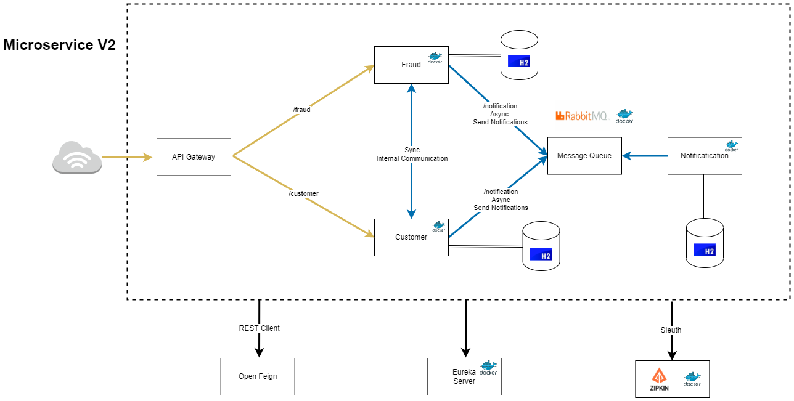

# Microservice V2

Microservice:

- [API Gateway](api-gateway/README.md)
- Config Server
- Service Registry:
    - [Eureka Server](eureka-server/README.md)
- Circuit Breaker:
    - Kafka
    - RabbitMQ (Docker)
        - http://localhost:15672
        - Login: guest
        - Password: guest
- Services:
    - [Fraud](service-fraud/README.md)
    - [Customer](service-customer/README.md)
    - [Notification](service-notification/README.md)
- Tracing
    - Zipkin and Spring Sleuth (Docker)
        - http://localhost:9411
- [OpenFeign](clients/README.md)



# Running the application

1. Terminal run `<Where you cloned the project>$ docker compose up`
2. Run `eureka-server` module
3. Run `eureka-server` module
4. Run `service-customer`, `service-fraud` or `service-notification`, modules. It doesn't matter the order
5. Open Postman:
    - Do a POST request <localhost:8081/customers/>
    - JSON

```json
{
  "firstName": "Ricardo",
  "lastName": "Ribeiro",
  "email": "ricardo@gmail.com"
}
```